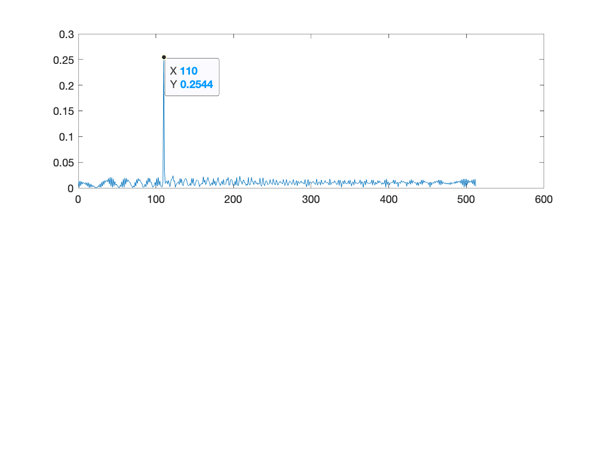
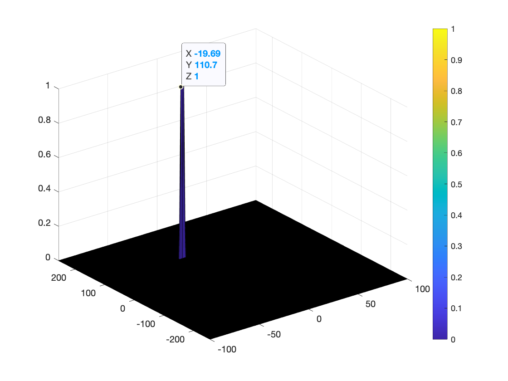

# Radar Target Generation and Detection


## Visualization of the results




## Implementation steps for the 2D CFAR process
Every cut needs to be from the 2D FFT response RDM. The cut size is identified by
chosen Training Cell Band and Guard Cell Band. If we denote Training Cells
for Range and Doppler directions as Tr and Td respectively, and Guard Cells
for Range and Doppler directions as Gr and Gd respectively, then CUT is a
2D slice of the RDM with following sizes:
```
        2*Tr + 2*Gr + 1  --> Two portions of Tr (trailing and leading)
                             Two portions of Gr (trailing and leading)
                             A single target in the middle
        2*Td + 2*Gd + 1  --> Same as Range direction
```
Hence, CUT is a rectangle that has `(2*Tr + 2*Gr + 1) * (2*Td + 2*Gd + 1)` cells in total.
This CUT has a guarding window that is made of Guarding cells and a single target in the middle.
The size of this window can be determined similarly, and has `(2*Gr + 1) * (2*Gd + 1)` total cells in it.
Subtracting total cells of guarding window from total cells in CUT gives us total Training Cells.
```
numTraining = (2*Tr + 2*Gr + 1) * (2*Td + 2*Gd + 1) - (2*Gr + 1) * (2*Gd + 1)
```
Taking the 2D slice in Matlab is very straightforward, given that target cell is at (ri, di)
```
trainingSlice = RDM(ri-Tr-Gr:ri+Tr+Gr, di-Td-Gd:di+Td+Gd)
```

Once we have the slice, anything within the guarding window should be set to 0 so that
they do not contribute to the calculation of mean. This can be easily done via
```
trainingSlice(ri-Gr:ri+Gr, di-Gd:di+Gd) = 0
```

Now, summing up all elements of trainingSlice will only sum up values in training cells
since guarding cells and target cell has been 0-ed out. Then dividing the result by numTraining
will give the average noise.

```
trainingSlice = db2pow(trainingSlice);
mean = sum(trainingSlice) / numTraining;
mean = pow2db(mean);
threshold = mean + offset;
```

Then we check whether target is above threshold, if so, we set CFAR for that position to 1.
```
if (RDM(ri, di) > threshold)
        CFAR(ri,di) = 1;
end
```

## Choosing Training and Guarding Band values
I have started choosing values from 8 for Training band on both range and doppler direction,
and from 1 for Guard band in both direction as well. After quite a lot of experiments with these
values, ended up with final Tr=12, Td=3, Gr=4, Gd=1 and offset=21.

